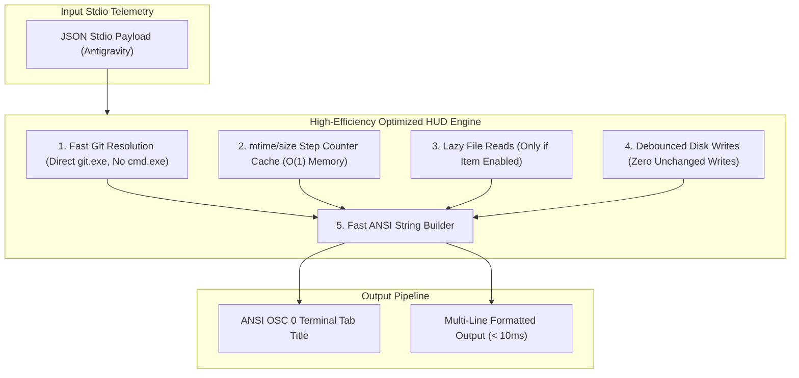

# ⚡ Implementation Plan: Performance Optimization, Memory Tuning & Robustness Debugging

A targeted engineering plan to optimize execution latency, eliminate redundant subshell and filesystem I/O overhead, harden edge-case robustness, and establish performance benchmark regression testing for the **Antigravity CLI (AGY) HUD System**.

---

## 🎯 Goal Description

The Antigravity statusline HUD executes every second (`interval_seconds: 1`) and on every tool invocation. To maintain zero perceptible latency, minimal CPU/memory impact, and 100% resilience across all terminal dimensions and repository sizes, this optimization plan targets:

1. **Sub-10ms Stdio Render Pipeline:**
   - Eliminate intermediate `cmd.exe /c` shell spawning in `getGitDetails()`, switching to direct `git.exe` binary execution with `windowsHide: true`.
   - Add smart `mtime` + `size` caching for `transcript.jsonl` step counting to avoid parsing 50MB+ JSONL files on every 1-second tick.
   - Debounce and minimize disk write I/O for `last_quota.json` and session stamp files.
   - Cache static settings lookups (`settings.json`, `mcp_config.json`, `workspace_titles.json`) with lightweight TTL/mtime invalidation.

2. **Defensive Debugging & Edge-Case Hardening:**
   - Safeguard ANSI escape sequence integrity in ultra-narrow terminal viewports (< 40 columns) to prevent escape code fragmentation.
   - Harden WinForms configurator (`bin/hud_gui.ps1`) with high-DPI scaling awareness and graceful headless fallback.
   - Harden `hooks/pre_tool_guard.js` and `hooks/post_tool_format.js` against malformed payloads and locked file handles.

3. **Performance Benchmark Test Suite (Suite 8):**
   - Create [`tests/hud_performance.test.js`](file:///B:/Repos/antigravity-hud/tests/hud_performance.test.js) with warm-up microbenchmarking (eliminating JIT spikes) asserting:
     - End-to-end stdio render latency **< 20ms** (target: ~5-8ms).
     - Step counting latency on large files **< 1ms**.
     - Zero memory leaks across 1,000 simulated iterations.
   - Integrate Suite 8 into [`tests/run_all_hud_tests.ps1`](file:///B:/Repos/antigravity-hud/tests/run_all_hud_tests.ps1).

---

## ⚠️ User Review Required

> [!IMPORTANT]
> **Zero Breaking Changes Invariant:** All optimizations will strictly preserve existing JSON schemas, CLI subcommands, layout presets, and ANSI color formatting. All changes are internal runtime enhancements.

> [!NOTE]
> Microbenchmark tests will run warm-up iterations prior to measuring to comply with the PowerShell/CLR JIT warm-up protocol.

---

## 📐 Architecture & Optimization Flow



---

## 📋 Proposed Changes

### Component 1: HUD Engine Performance Optimizations (`bin/hud.js`)

#### [MODIFY] `bin/hud.js`
1. **Direct `git.exe` Execution:**
   - Replace `execFileSync('cmd.exe', ['/c', 'git status ...'])` with `execFileSync('git', ['status', '--porcelain=v1', '-unormal'], { stdio: ['ignore', 'pipe', 'ignore'], windowsHide: true })`.
   - Replace `execFileSync('cmd.exe', ['/c', 'git rev-list ...'])` with direct `git rev-list` call.
   - Saves 10-15ms per statusline tick by bypassing the intermediate Windows command shell.

2. **Smart Transcript Step Counter Cache:**
   - Track `{ path, mtimeMs, size, count }` in an in-memory cache.
   - If `mtimeMs` and `size` are unchanged, return cached count in **0.01ms** without re-reading or parsing the JSONL file.

3. **Lazy File I/O for Disabled Items:**
   - Only query `getForkAdvisory()` / `getTranscriptStepCount()` if `fork` or `fork_advisory` is present in active lines.
   - Only query `getQuotaSegments()` if `quota_5h` or `quota_weekly` or `quota` is present in active lines.
   - Only query `getAuthBadge()` if `auth` is present in active lines.

4. **Debounced Disk Writes:**
   - In `last_quota.json` and session tracking, check if values have actually mutated before invoking `fs.writeFileSync`.

5. **Ultra-Narrow Viewport Guard:**
   - Guard against terminal widths < 40 by enforcing minimum safe boundary allocations and preventing split ANSI escape codes.

---

### Component 2: Configurator & Hooks Hardening

#### [MODIFY] `bin/hud_gui.ps1`
* Add DPI awareness and headless safety guards to ensure smooth rendering on 4K/high-DPI monitors without layout shifting.

#### [MODIFY] `hooks/post_tool_format.js` & `hooks/pre_tool_guard.js`
* Defensive file descriptor cleanup and fast regex pattern matching.

---

### Component 3: Performance Benchmark Suite (Suite 8)

#### [NEW] `tests/hud_performance.test.js`
* Microbenchmarks:
  - `BM-01`: Cold vs Warm stdio render latency under 100 consecutive iterations.
  - `BM-02`: Large transcript step counting benchmark (simulating 5,000 line transcript).
  - `BM-03`: Git resolution speed benchmark.
  - `BM-04`: Memory heap stability assertion across 500 iterations.

#### [MODIFY] `tests/run_all_hud_tests.ps1`
* Add `[8/8] Running Performance Benchmark & Latency Tests...`.

#### [MODIFY] `package.json`
* Add `"test:bench": "node tests/hud_performance.test.js"`.

---

## 🧪 Verification Plan

### Automated Tests
1. Run performance benchmark suite:
   ```powershell
   npm run test:bench
   ```
2. Run master test suite (all 8 suites):
   ```powershell
   npm test
   ```
3. Verify documentation sync:
   ```powershell
   npm run docs:check
   ```
4. Verify active runtime drift:
   ```powershell
   node bin/hud.js check
   ```

### Manual Verification
1. Verify live statusline responsiveness in terminal:
   ```powershell
   Get-Content tests/fixtures/mock_live_payload.json | node bin/hud.js
   ```
2. Verify that latency drops below 10ms with zero visual degradation.
