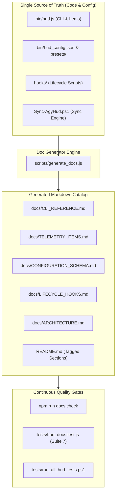

# 📚 Implementation Plan: Automated Documentation Engine for Antigravity HUD

A robust, self-generating documentation system for the **Antigravity CLI (AGY) HUD System** that eliminates manual documentation drift, enforces a single source of truth (SSOT) across CLI subcommands, telemetry items, configuration schemas, and lifecycle hooks, and integrates automated staleness verification into the master test runner.

---

## 🎯 Goal Description

As the Antigravity HUD codebase has expanded to include 16 telemetry items, 20+ CLI subcommands, 4-tier layout presets, bidirectional synchronization, and a zero-quota lifecycle hooks suite, maintaining accurate documentation across `README.md`, developer guides, schema docs, and CLI help requires automation.

This plan introduces:
1. **Authoritative Metadata Registry (`scripts/generate_docs.js`):** A centralized Node.js documentation generator that parses CLI definitions, telemetry items, hook interfaces, and configuration schemas.
2. **Automated Documentation Catalog (`docs/`):**
   - [`docs/ARCHITECTURE.md`](file:///B:/Repos/antigravity-hud/docs/ARCHITECTURE.md): System design, process lifecycle, bidirectional sync mechanics, and Mermaid sequence diagrams.
   - [`docs/CLI_REFERENCE.md`](file:///B:/Repos/antigravity-hud/docs/CLI_REFERENCE.md): Full CLI specification with syntax, flags, examples, and exit codes.
   - [`docs/TELEMETRY_ITEMS.md`](file:///B:/Repos/antigravity-hud/docs/TELEMETRY_ITEMS.md): Detailed 16-item telemetry registry, payload paths, formatting tiers (`full`, `short`, `minimal`), and threshold colorings.
   - [`docs/CONFIGURATION_SCHEMA.md`](file:///B:/Repos/antigravity-hud/docs/CONFIGURATION_SCHEMA.md): Complete schema documentation for `hud_config.json`, layout presets, and custom overrides.
   - [`docs/LIFECYCLE_HOOKS.md`](file:///B:/Repos/antigravity-hud/docs/LIFECYCLE_HOOKS.md): Hook execution lifecycle, pre/post guards, detached post-exit worker, permanent JSONL logging, and Windows 11 toast notifications.
3. **`README.md` Automated Sync Markers:** Embedded comment delimiters (`<!-- AUTO-DOC:CLI -->` and `<!-- AUTO-DOC:ITEMS -->`) allowing `generate_docs.js` to update root README tables automatically.
4. **Staleness Regression Testing (Suite 7):** Integration of `npm run docs:check` and [`tests/hud_docs.test.js`](file:///B:/Repos/antigravity-hud/tests/hud_docs.test.js) into [`tests/run_all_hud_tests.ps1`](file:///B:/Repos/antigravity-hud/tests/run_all_hud_tests.ps1) to guarantee zero documentation drift on commit.

---

## ⚠️ User Review Required

> [!IMPORTANT]
> **Single Source of Truth Invariant:** Documentation generation will be deterministic and non-destructive. Hand-authored narrative sections in `README.md` and `docs/` will be preserved; only sections delimited by `<!-- AUTO-DOC:<SECTION> -->` will be dynamically overwritten.

> [!NOTE]
> All generated documentation files will use GitHub-flavored Markdown with absolute and relative code links adhering to Antigravity terminal formatting standards.

---

## 📐 Architecture & Data Flow



---

## 📋 Proposed Changes

### Component 1: Documentation Generation Engine

#### [NEW] `scripts/generate_docs.js`
* Extracts and formats:
  - **CLI Subcommand Catalog:** Name, aliases, description, arguments, examples, and default values.
  - **Telemetry Items Registry:** 16 metrics with data sources, full/short/minimal rendering samples, and color thresholds.
  - **Configuration Schema:** JSON property definitions, validation rules, default configurations, and presets.
  - **Lifecycle Hooks Guide:** Parameter interfaces, execution triggers, and error exit codes.
* Supports CLI modes:
  - `node scripts/generate_docs.js`: Writes/updates all markdown files in `docs/` and updates `README.md`.
  - `node scripts/generate_docs.js --check`: Performs a dry-run check comparing generated output against disk, exiting with code 1 if drift is detected.

---

### Component 2: Markdown Documentation Catalog (`docs/`)

#### [NEW] `docs/CLI_REFERENCE.md`
* Full exhaustive manual of all CLI commands:
  - Layout: `hud`, `hud list`, `hud lines`, `hud compact`, `hud style`, `hud preset`
  - Lifecycle & Milestones: `hud fork`, `hud uptime`, `hud ticker`, `hud title`, `hud sync-projects`
  - Runtime Sync & Healing: `hud diff`, `hud backup`, `hud deploy`, `hud check`, `hud repair`
  - Configurator & Utils: `hud gui`, `hud edit`, `hud reset`, `hud help`

#### [NEW] `docs/TELEMETRY_ITEMS.md`
* In-depth breakdown of all 16 metrics:
  - Identification: `workspace`, `git_status`, `model`, `state`
  - Resources: `context`, `quota_5h`, `quota_weekly`, `session`
  - Background Workers: `mcp`, `tasks`, `subagents`, `artifacts`, `queue`
  - Security & Milestones: `sandbox`, `auth`, `fork`
  - Multi-tier rendering table (`full`, `short`, `minimal`) and ANSI color grading rules.

#### [NEW] `docs/CONFIGURATION_SCHEMA.md`
* Schema specification for `hud_config.json`:
  - Top-level properties (`name`, `description`, `lines`, `two_line`, `separator`, `compact_mode`, `line1..4`, `disabled`, `item_styles`, `session_uptime`, `fork_advisory`).
  - Layout presets documentation (`4line_command_center`, `3line_cockpit`, `2line_classic`, `1line_compact`).

#### [NEW] `docs/LIFECYCLE_HOOKS.md`
* Architecture and implementation guide for the 4 zero-quota hooks:
  - `hooks/on_session_start.ps1`
  - `hooks/on_session_exit.ps1`
  - `hooks/pre_tool_guard.js`
  - `hooks/post_tool_format.js`
  - JSONL permanent logging specification and toast notification subsystem.

#### [NEW] `docs/ARCHITECTURE.md`
* High-level architectural specification:
  - Stdio pipeline integration with Antigravity AI agent.
  - Sub-millisecond rendering pipeline and ANSI terminal tab synchronization.
  - Bidirectional runtime/repository synchronization model.

---

### Component 3: Root `README.md` Synchronization

#### [MODIFY] `README.md`
* Inject marker delimiters around the CLI Command Reference and Telemetry Elements tables:
  - `<!-- AUTO-DOC:CLI_TABLE:START -->` ... `<!-- AUTO-DOC:CLI_TABLE:END -->`
  - `<!-- AUTO-DOC:ITEMS_TABLE:START -->` ... `<!-- AUTO-DOC:ITEMS_TABLE:END -->`
* Add links to the new `docs/` catalog in the README navigation header.

---

### Component 4: Test Suite Expansion & Validation Gates

#### [NEW] `tests/hud_docs.test.js`
* Suite 7 regression tests:
  - Asserts that all 5 documents in `docs/` exist and are populated.
  - Asserts that `README.md` contains valid sync markers and updated content.
  - Runs `generate_docs.js --check` to guarantee 0% documentation drift.
  - Asserts that all internal links in `docs/` point to valid existing files.

#### [MODIFY] `tests/run_all_hud_tests.ps1`
* Add `[7/7] Running Documentation Parity & Schema Tests...` invoking `tests/hud_docs.test.js`.

#### [MODIFY] `package.json`
* Add documentation scripts:
  - `"docs": "node scripts/generate_docs.js"`
  - `"docs:check": "node scripts/generate_docs.js --check"`

---

## 🧪 Verification Plan

### Automated Tests
1. Generate documentation:
   ```powershell
   npm run docs
   ```
2. Verify zero-drift check:
   ```powershell
   npm run docs:check
   ```
3. Run the complete master test suite (all 7 suites):
   ```powershell
   npm test
   ```

### Manual Verification
1. Inspect generated markdown files in `docs/` for formatting fidelity and working relative links.
2. Verify that `README.md` tables accurately reflect active CLI subcommands and telemetry elements.
3. Test `hud diff` and `hud check` to ensure documentation additions do not disrupt active runtime sync parity.
