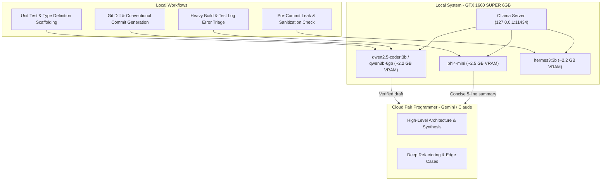

# Local Ollama Agent Integration Plan: Zero-Quota Hybrid Architecture

Comprehensive blueprint for leveraging local Ollama models (Qwen 2.5 Coder, Phi-4 Mini, Hermes-3) on NVIDIA GTX 1660 SUPER (6 GB VRAM) alongside Antigravity to eliminate cloud token consumption on bulk tasks.

---

## 🎯 Architecture Overview

---

## 🖥️ Target Hardware Constraints & Model Matrix

* **Host GPU**: NVIDIA GeForce GTX 1660 SUPER (6 GB GDDR6 VRAM)
* **VRAM Safety Invariant**: Keep total VRAM utilization `< 4.5 GB` to prevent display stutter, offloading to system RAM, or OS UI lag.

| Model | Size / Quant | VRAM Footprint | Best Use Case |
| :--- | :--- | :--- | :--- |
| **`qwen2.5-coder:3b` / `qwen3b-6gb`** | Q4_K_M (~2.0 GB) | ~2.4 GB | Fast code completions, boilerplate scaffolding, git commit messages. |
| **`phi4-mini`** | 3.8B (~2.5 GB) | ~2.9 GB | Deep reasoning, massive log compression, test triage, structured JSON extraction. |
| **`hermes3:3b`** | 3B (~2.0 GB) | ~2.4 GB | Pre-commit security audits, zero-leak sweeps, structured tool formatting. |
| **`qwen2.5-coder:1.5b`** | 1.5B (~1.0 GB) | ~1.3 GB | Ultra-fast inline completions (< 30ms latency), git hook checks. |

---

## 🚀 Key Feature Implementations (Future Roadmap)

### Feature 1: Zero-Quota Conventional Commit & PR Generator (`Invoke-OllamaCommit.ps1`)
* Inspects `git diff --staged`.
* Passes the diff to local `qwen2.5-coder:3b` on `http://127.0.0.1:11434/api/generate`.
* Formats a conventional commit message (`feat(...)`, `fix(...)`, `docs(...)`) with 0 API tokens burned.

### Feature 2: Large Log & Stack Trace Compressor (`Compress-LogWithOllama.ps1`)
* Takes massive build or Pester failure logs (1,000–50,000 lines).
* Uses `phi4-mini` to extract only the 5 critical error lines and failure root cause.
* Passes only the distilled summary into Antigravity context.

### Feature 3: Local Ollama MCP Server Integration
* Registers `ollama-mcp` in `~/.gemini/settings.json` so Antigravity can call `mcp_ollama_query` for bulk data processing.

---

## 📌 Status
* **State**: Plan codified and branch saved (`feature/local-ollama-agents`).
* **Execution**: Scheduled for future activation after core Lifecycle Hooks implementation.
