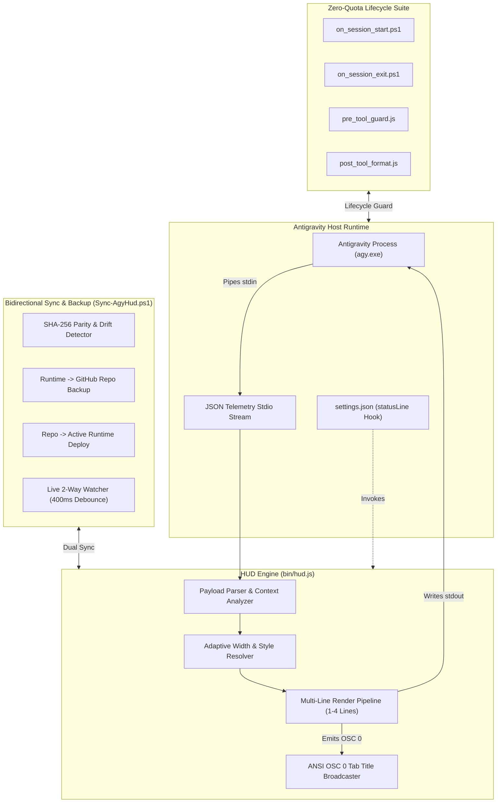

# 🏗️ Antigravity HUD System Architecture

A high-performance, real-time TUI statusline HUD, live telemetry monitor, bidirectional runtime synchronizer, and zero-quota lifecycle suite for Antigravity AI Agent sessions.

---

## 🏛️ System Component Architecture

---

## ⚡ Data Flow & Sub-Millisecond Rendering

1. **Stdio Ingestion:** Antigravity periodically pipes session telemetry JSON to `bin/hud.js` via `process.stdin`.
2. **Local Telemetry Extraction:**
   - Evaluates token counts, cache read percentages, and 5-hour/weekly quotas.
   - Inspects transcript step count locally from disk (`transcript.jsonl`).
   - Evaluates Git clean/dirty state via fast local subshell.
3. **Layout & Style Resolution:**
   - Inspects terminal column width and per-item style overrides (`item_styles`).
   - Renders 1 to 4 configurable lines delimited by custom separators (`│`).
4. **ANSI Emission & Tab Synchronization:**
   - Broadcasts ANSI OSC 0 escape sequences (`\x1b]0;[agy] <workspace>\x07`) to dynamically label Windows Terminal tabs.
   - Emits formatted multi-line statusline to `process.stdout` in **< 15 milliseconds**.
